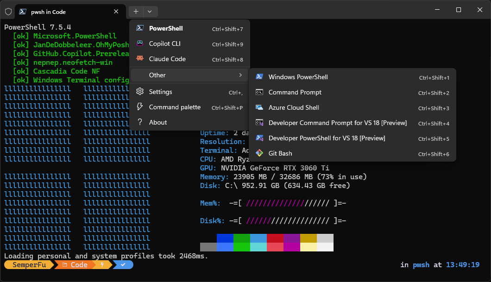

# PowerShell Profile

A self-bootstrapping PowerShell profile for Windows. Set up a new machine, install your tools, configure Windows Terminal, and keep everything in sync across computers.

I work across multiple machines, personal, work, and VMs that get wiped regularly. Got tired of manually setting up PowerShell, installing tools, and configuring the terminal every time. This profile handles all of it on first launch and keeps everything consistent through cloud sync.

[](https://github.com/PowerShell/PowerShell) [](https://github.com/microsoft/terminal) [](https://github.com/JanDeDobbeleer/oh-my-posh)



## What It Does

On every shell startup, the profile runs through a checklist and reports status:

```
  [ok] Microsoft.PowerShell
  [^^] JanDeDobbeleer.OhMyPosh : 29.7.0 -> 30.0.0
  [^^] GitHub.Copilot : v0.0.419 -> v0.0.420
  [>>] nepnep.neofetch-win installing...
  [ok] nepnep.neofetch-win installed
  [ok] Cascadia Code NF
  [ok] Windows Terminal config
  [ok] GlyphShell 0.1.0

  To update these packages, copy and run:
  winget update JanDeDobbeleer.OhMyPosh GitHub.Copilot
```

- `[ok]` - installed, up to date
- `[^^]` - update available (shows version diff)
- `[>>]` - installing right now
- `[!!]` - something went wrong

When updates are found, it prints a ready-to-copy `winget update` command so you can update just your tracked packages instead of `winget update --all`.

## Features

### Package Management
Keeps a list of WinGet packages and checks them on startup. Missing packages get installed automatically. Packages with updates show the version diff. Uses a single `Get-WinGetPackage` batch call with local filtering - no extra network requests. Package list is configured in [`bootstrap-config.json`](CUSTOMIZATION.md) - no need to edit the script.

### Windows Terminal Configuration
Automatically configures Windows Terminal on PS7:
- Installs Cascadia Code NF (Nerd Font) via Oh My Posh if missing and sets it as the default font
- Sets PowerShell 7 as the default profile
- Adds/removes terminal profiles for **Copilot CLI** and **Claude Code** based on whether they're installed
- Uses custom icons (`Copilot.png`, `ClaudeCode.png`) if they exist next to the profile, falls back to the default PowerShell icon. *Icons are derived from GitHub and Anthropic branding and used for personal terminal identification only.*
- Organizes the new tab menu with your main profiles up top and everything else in an "Other" folder
- Only writes `settings.json` when something actually changed

### Tab Completions
Registers tab completions for tools if they're installed - skips any that aren't:

| Tool | Type | What you get |
|------|------|-------------|
| **winget** | Native | Package names, subcommands, flags, versions |
| **dotnet** | Native | Commands, project names, options (requires SDK) |
| **gh** | Script | Full GitHub CLI completions |
| **kubectl** | Script | Kubernetes resource types, namespaces, flags |
| **az** | Native | Azure CLI commands and parameters (via argcomplete, requires v2.49+) |
| **docker** | Script | Container names, images, commands |

**Native** completers call the tool's `complete` command on each Tab press. **Script** completers load a completion script into the session at startup.

These are zero-cost at startup if the tool isn't installed - a single batched `Get-Command` check covers all tools at once.

### PSReadLine
Ensures PSReadLine is at least v2.4.5 on PS7 (updates automatically if below). Configures completions, predictions, and history navigation.

**MenuComplete** - pressing **Tab** shows a dropdown of all matching completions (directories, commands, parameters) instead of cycling through them one at a time:

```
> cd E:\Code\
  > Aseprite\
    Bloxels\
    ConwaysBattlegrounds\
    DonutRun\
    TerminalBootstrap\
```

**ListView predictions** - as you type, a dropdown of matching history entries appears inline. Press **F2** to toggle between ListView and inline suggestion styles:

```
> Get-Chi
  > Get-ChildItem -Path E:\Code\Projects -Recurse
    Get-ChildItem -Filter *.log
    Get-ChildItem | Sort-Object LastWriteTime
    Get-CimInstance -ClassName Win32_OperatingSystem
```

**CompletionPredictor** - bridges tab completers (winget, dotnet, gh, docker, etc.) into the ListView dropdown, so tool-specific completions appear as you type - not just on Tab. Installed automatically if missing.

**History search** - **Up/Down** arrows filter history by what you've already typed. Start typing `Get-Ch` and press Up to cycle through only commands that started with `Get-Ch`. When the ListView dropdown is visible, arrows navigate the list instead - both features coexist.

### Shell & Prompt
- Loads **Oh My Posh** prompt theme
- Runs **neofetch** for system info display
- On PS7+, auto-installs [**GlyphShell**](https://github.com/SemperFu/GlyphShell) - a high-performance C# replacement for Terminal-Icons that hooks into `Get-ChildItem` to add Nerd Font icons, colors, and extra columns. Includes tree views (`gstree`), grid views (`gsgrid`), git status indicators, and 900+ icon mappings. On PS5, falls back to **Terminal-Icons** which provides the same basic icon experience.

## Setup

### Quick Start

Paste this into any PowerShell window (works in the built-in Windows PowerShell 5.1 on a fresh machine):

```powershell
$b = "https://raw.githubusercontent.com/SemperFu/TerminalBootstrap/master"
mkdir ~\Documents\PowerShell, ~\Documents\WindowsPowerShell -Force | Out-Null
iwr "$b/Microsoft.PowerShell_profile.ps1" -OutFile ~\Documents\PowerShell\Microsoft.PowerShell_profile.ps1
iwr "$b/WindowsPowerShell_profile.ps1" -OutFile ~\Documents\WindowsPowerShell\Microsoft.PowerShell_profile.ps1
iwr "$b/bootstrap-config.json" -OutFile ~\Documents\PowerShell\bootstrap-config.json
```

Open a new PowerShell window and the profile will bootstrap everything on first run (including installing PowerShell 7 if missing).

Edit `bootstrap-config.json` (next to your profile) to add/remove packages, modules, CLI profiles, or change the theme. See [CUSTOMIZATION.md](CUSTOMIZATION.md) for details.

### Manual Setup

1. Copy [`Microsoft.PowerShell_profile.ps1`](Microsoft.PowerShell_profile.ps1) to your PowerShell profile directory:
   ```
   ~\Documents\PowerShell\Microsoft.PowerShell_profile.ps1
   ```

2. Open a new PowerShell 7 window. It'll bootstrap everything on first run.

### Windows PowerShell (5.1) Support

The profile works on both PS7 and PS5. To share a single config, copy [`WindowsPowerShell_profile.ps1`](WindowsPowerShell_profile.ps1) to the PS5 profile location:

```
~\Documents\WindowsPowerShell\Microsoft.PowerShell_profile.ps1
```

It dot-sources the PS7 profile so both shells use the same config. PS7-only features (like Windows Terminal config) are gated behind version checks and just skip on PS5.

### Syncing Across Computers

The profile is a single file. Put it somewhere that syncs (OneDrive, Google Drive, Dropbox, a git repo) and dot-source it from your profile path:

```powershell
# ~\Documents\PowerShell\Microsoft.PowerShell_profile.ps1
. "$HOME\OneDrive\PowerShell\Microsoft.PowerShell_profile.ps1"
```

If your Documents folder already syncs through OneDrive, it's automatic - nothing extra to do.

### Customization

Edit `bootstrap-config.json` next to your profile to customize packages, modules, CLI profiles, theme, and output verbosity - no need to touch the script itself. See [CUSTOMIZATION.md](CUSTOMIZATION.md) for the full reference.

## Requirements

- **Windows 10/11** with WinGet
- **PowerShell 7** recommended (PS5 works with reduced features)
- **Windows Terminal** for terminal config features

Everything else gets installed by the profile itself.
